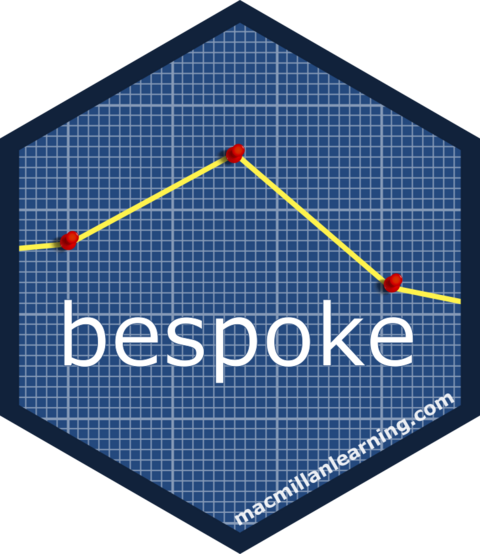

<!-- README.md is generated from README.Rmd. Please edit that file -->

```{r, include = FALSE}
knitr::opts_chunk$set(
  collapse = TRUE,
  comment = "#>",
  fig.path = "man/figures/README-",
  out.width = "100%"
)
```

# bespoke

# bespoke 

<!-- badges: start -->
[](https://github.com/macmillancontentscience/bespoke/actions/workflows/R-CMD-check.yaml)
<!-- badges: end -->

Sometimes it makes sense to define a simple baseline model programmatically, using simple rules defined by subject matter experts.
However, it can be difficult to compare such models to "real" models developed in the [{tidymodels}](https://www.tidymodels.org/) framework.
{bespoke} allows you to wrap such a hand-crafted "model" into a format that fits within the {tidymodels} framework.

## Installation

You can install the development version of bespoke from [GitHub](https://github.com/) with:

``` r
# install.packages("remotes")
remotes::install_github("macmillancontentscience/bespoke")
```
